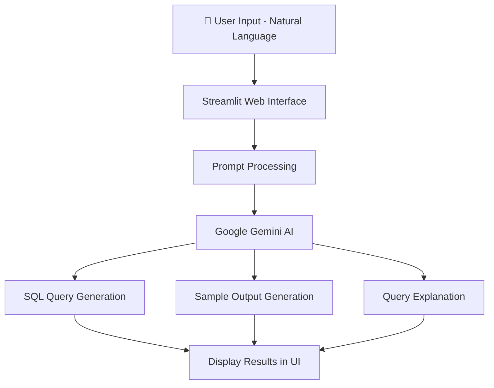

<div align="center">

# 🧮 QueryMind

### Natural Language to SQL Generator powered by Gemini AI

**An AI-powered SQL assistant that converts plain English prompts into executable SQL queries, complete with sample outputs and explanations.**
*Describe the data you want — QueryMind generates the SQL instantly.*

<br>

[](https://www.python.org/)
[](https://streamlit.io/)
[](https://deepmind.google/technologies/gemini/)
[](https://pypi.org/project/python-dotenv/)
[]()

</div>

---

# 📖 What is QueryMind?

QueryMind is an **AI-powered SQL query generator** that translates **natural language prompts into SQL queries** using Google’s Gemini AI.

Instead of manually writing complex SQL queries, users can simply describe the data they want in **plain English**, and the system will automatically:

1. Generate the **correct SQL query**.
2. Show a **sample tabular output** of the expected result.
3. Provide a **human-readable explanation** of the query logic.

Built using **Streamlit**, the application offers an intuitive interface that allows developers, students, and analysts to quickly generate SQL queries without deep database expertise.

---

# ✨ Features

| Feature                          | Description                                          |
| -------------------------------- | ---------------------------------------------------- |
| 🧠 **AI-Powered SQL Generation** | Converts natural language prompts into SQL queries   |
| 📊 **Sample Output Generation**  | Displays expected result tables                      |
| 📖 **Query Explanation**         | Provides easy-to-understand explanation of SQL logic |
| ⚡ **Fast Interactive UI**        | Built with Streamlit for rapid interaction           |
| 🔐 **Secure API Key Management** | Uses `.env` configuration with python-dotenv         |
| 🎓 **Learning Tool**             | Great for students learning SQL concepts             |

---

# 🏗️ System Architecture

### Query Generation Pipeline



---

### AI Processing Workflow

The system follows a simple yet effective pipeline:

1️⃣ **User Prompt**

* The user enters a query request in plain English.

Example:

```
Retrieve employee names and departments from the employees table where department is Sales
```

2️⃣ **AI Interpretation**

* Gemini AI interprets the prompt and understands:

  * table name
  * fields
  * conditions

3️⃣ **SQL Generation**

* The model generates the corresponding SQL statement.

4️⃣ **Output Simulation**

* The system generates a **sample result table**.

5️⃣ **Explanation**

* Gemini explains the SQL query in simple terms.

---

# 🛠️ Technology Stack

### Core System

| Component              | Technology                  |
| ---------------------- | --------------------------- |
| Programming Language   | `Python`                    |
| Web Framework          | `Streamlit`                 |
| AI Model               | `Google Gemini AI`          |
| Environment Management | `python-dotenv`             |
| Data Processing        | `Python Standard Libraries` |

---

# 📂 Project Structure

```text
SQL-Query-Generator-using-Gemini-AI/
│
├── app.py                 # Streamlit application
├── query_generator.py     # Gemini AI prompt handler
├── utils/
│   └── prompt_templates.py
│
├── requirements.txt       # Python dependencies
├── .env                   # API key configuration
└── README.md
```

---

# 🚀 Installation & Setup

### Prerequisites

* Python 3.9+
* Google AI Studio API Key

---

# 1️⃣ Clone the Repository

```bash
git clone https://github.com/kishorekrrish3/SQL-Query-Generator-using-Gemini-AI.git
cd SQL-Query-Generator-using-Gemini-AI
```

---

# 2️⃣ Install Dependencies

```bash
pip install -r requirements.txt
```

Or install individually:

```bash
pip install streamlit
pip install google-generativeai
pip install python-dotenv
```

---

# 3️⃣ Configure API Key

Create a `.env` file in the project root.

```
GOOGLE_API_KEY=your_google_api_key_here
```

The application automatically loads the key using **python-dotenv**.

---

# 🏃 Running the Application

Start the Streamlit application:

```bash
streamlit run app.py
```

The application will run locally at:

```
http://localhost:8501
```

---

# 🌐 Application Workflow

### Step 1 — Enter Natural Language Query

Example prompt:

```
Retrieve all employee names and departments from the employees table where the department is Sales
```

---

### Step 2 — Generate SQL

Click **Generate SQL Query**.

The system sends the prompt to **Gemini AI**.

---

### Step 3 — View Results

The interface displays:

| Output        | Description                      |
| ------------- | -------------------------------- |
| SQL Query     | Generated SQL statement          |
| Sample Output | Example result table             |
| Explanation   | Human-readable query explanation |

---

# 📊 Example Output

### Input Prompt

```
Retrieve all employee names and departments from the employees table where the department is Sales
```

---

### Generated SQL Query

```sql
SELECT name, department
FROM employees
WHERE department = 'Sales';
```

---

### Expected Output

| name     | department |
| -------- | ---------- |
| John Doe | Sales      |
| Jane Roe | Sales      |

---

### Explanation

The query retrieves the **name** and **department** fields from the **employees table**, filtering records where the department equals **Sales**.

---

# ⚙️ Configuration

| Setting          | File                  | Description                      |
| ---------------- | --------------------- | -------------------------------- |
| API Key          | `.env`                | Google Gemini API authentication |
| Prompt Templates | `prompt_templates.py` | Query generation prompts         |
| Streamlit UI     | `app.py`              | Interface and interaction logic  |

---

# 🐛 Known Issues & Troubleshooting

### Gemini API not working

Check that:

* `.env` file exists
* `GOOGLE_API_KEY` is valid
* Internet connection is active

---

### Streamlit app not loading

Restart the server:

```bash
streamlit run app.py
```

---

# 🔮 Future Improvements

* 🧠 **Database schema awareness**
* 🔗 **Direct database execution**
* 📊 **Visual query builder**
* 📚 **SQL learning mode for beginners**
* 🗂 **Multi-database support (MySQL, PostgreSQL, SQLite)**

---

# 🤝 Contributing

Contributions are welcome.

1. Fork the repository
2. Create a feature branch
3. Commit your changes
4. Open a pull request

---

# 📜 License

This project is licensed under the **MIT License**.

---

<div align="center">

<br>

<i>Making databases accessible through natural language.</i>

<br><br>

<b>QueryMind</b> — where English becomes SQL.

</div>
